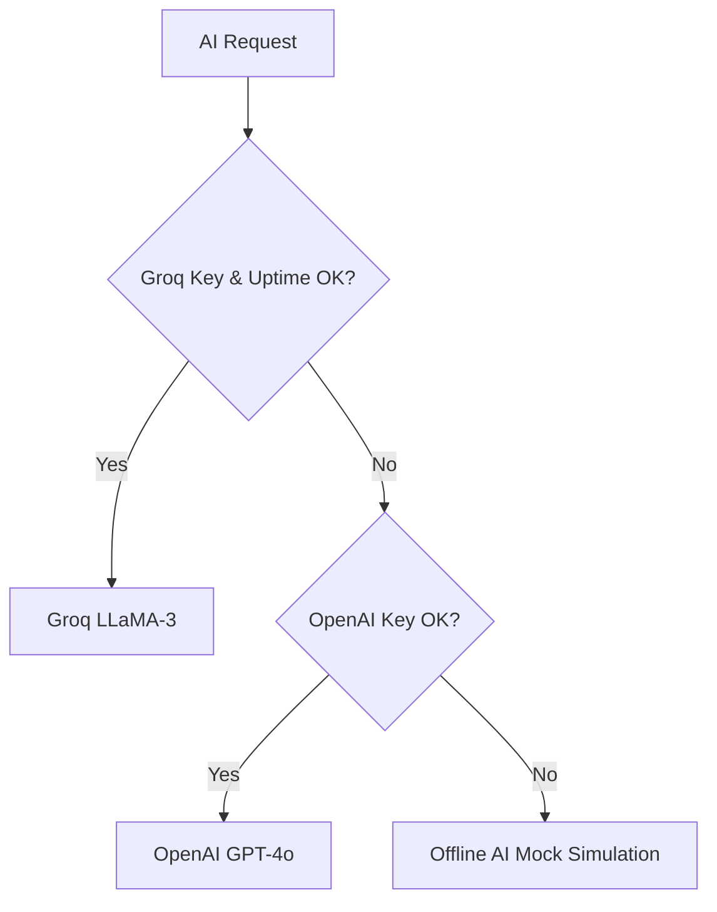

# ⚙️ CampusFlow Environment Variables Reference

This document provides a dictionary of all environment variables required to run the CampusFlow frontend and backend.

---

## 💻 Backend Environment Variables (`backend/.env`)

Configure these values in the `backend/.env` file. A sample template is provided at [`backend/.env.example`](file:///home/luffy/.gemini/antigravity-ide/scratch/Campus_flow/backend/.env.example).

| Variable Name | Default Value | Required? | Description |
|---|---|---|---|
| `NODE_ENV` | `development` | Yes | App runtime state. Set to `production` in hosted environments to trigger warnings logging to files. |
| `PORT` | `5000` | Yes | The port the Node/Express server listens on. Avoid using 3000 to prevent Next.js port collisions. |
| `JWT_SECRET` | `super_secret_dev_key_12345` | Yes | Encryption key for signing user authorization JWT tokens. Make sure to generate a long secure key in production. |
| `JWT_EXPIRES_IN` | `1d` | No | Expire duration for tokens (e.g., `1d`, `7d`, `12h`). |
| `SUPABASE_URL` | *None* | Yes | The project URL of your Supabase project (e.g., `https://xyz.supabase.co`). |
| `SUPABASE_SERVICE_ROLE_KEY` | *None* | Yes | The service role API key. Bypasses RLS policies to perform admin DB operations. |
| `GROQ_API_KEY` | *None* | No | API key for Groq LLaMA-3 access. If omitted, the service falls back to OpenAI. |
| `GROQ_MODEL` | `llama-3.3-70b-versatile` | No | Model identifier to request from Groq. |
| `OPENAI_API_KEY` | *None* | No | API key for OpenAI access. If both Groq and OpenAI are missing, mock data is returned. |
| `OPENAI_MODEL` | `gpt-4o-mini` | No | Model identifier to request from OpenAI. |
| `AUTOMATION_WEBHOOK_SECRET` | `dev_automation_secret_123` | Yes | Inbound webhook auth key checked via the `X-Automation-Token` header. |

---

## 🎨 Frontend Environment Variables (`frontend/.env.local`)

Configure this key in the `frontend/.env.local` file for client-side API requests.

| Variable Name | Default Value | Required? | Description |
|---|---|---|---|
| `NEXT_PUBLIC_API_URL` | `http://localhost:5000/api/v1` | Yes | The fully-qualified backend REST endpoint path where client HTTP calls are sent. |

---

## 🔄 Dynamic Fallbacks & Fail-Safes

CampusFlow features production-ready fallback routes to ensure developers never experience build locks or local connection crashes:

### 1. Database Failsafes
If `SUPABASE_URL` or `SUPABASE_SERVICE_ROLE_KEY` are not configured (e.g., set to default mock keys), the backend database repository layers will catch connection errors, log warnings to winston, and return **fully mock-free mock schemas**. This prevents 500 error crashes and lets you test pages immediately.

### 2. Dual LLM Fallbacks
If Groq rate-limits are reached or API keys are missing, the AI service chain intercepts the call:

If both keys are missing, the service generates realistic offline responses so features like Flashcard generator or Resume analyzer still return correct structures.
